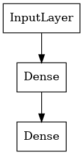
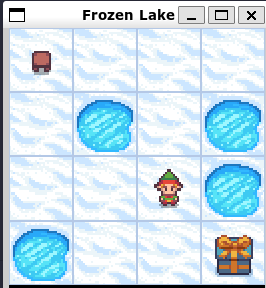

# ai-coding-practice

## Author: Ariel Guerrero

### Description

Learning Reinforced Learning, Neural Networks, Deep Learning, and many more exciting topics related to AI.

___

## Single Agent

* learning about ***discrete and continuous environments*** that agents can act on
randomly selecting appropriate actions to take in a given environment.

* code example: ***single_agent.ipynb***

## Q-Learning Agent

* learning about the ***concept of Q-Learning***, which is ***a form of reinforcement learning***
that uses a Q-table to store the Q-values of the actions that the agent can take
in a given environment.

* ***Q-Learning Algorithm***
  * ***Q(st, at) = Rt+1 + gamma * max(Q(st+1))***

  * s = state
  * a = action
  * Rt+1 = reward
  * gamma = discount factor
  * max(Q(st+1) = max Q value ***for all possible actions*** in state st+1

* reference: [Q-Learning algorithm](https://en.wikipedia.org/wiki/Q-learning)

* code example: ***q_agent.ipynb***

## Q-Learning Agent with Neural Network

* Using ***Q-Learning algorithm*** and a ***Sequential Model with two dense layers*** to
dive deeper in learning about the concept of deep learning.

&emsp;&emsp;

* code example: ***q_agent_nn.ipynb***

## Default Enviroment
 * **Frozen Lake**
 
 
